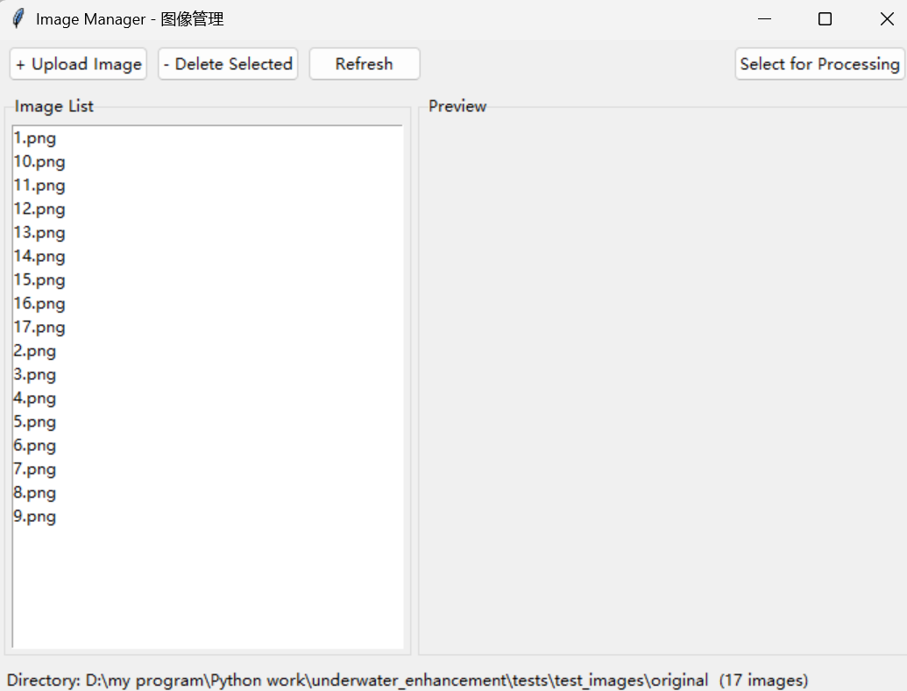
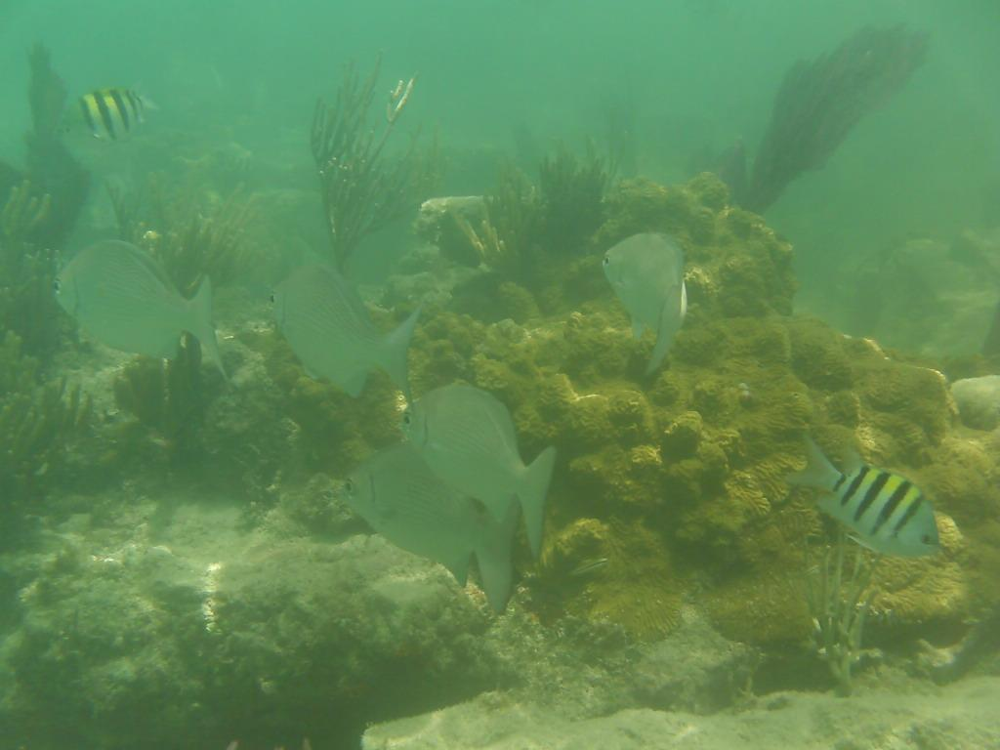
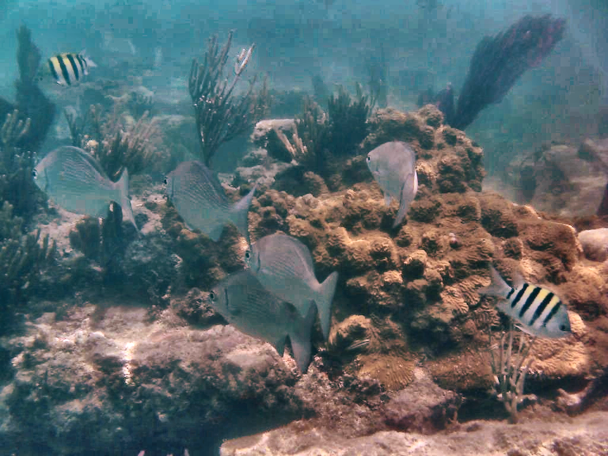
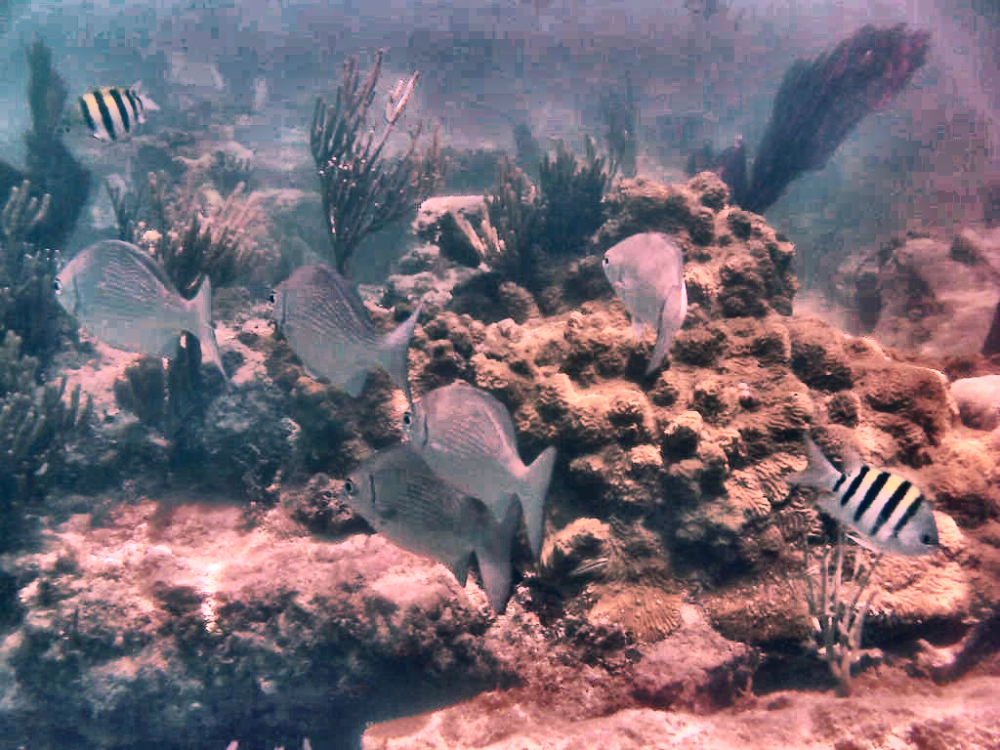
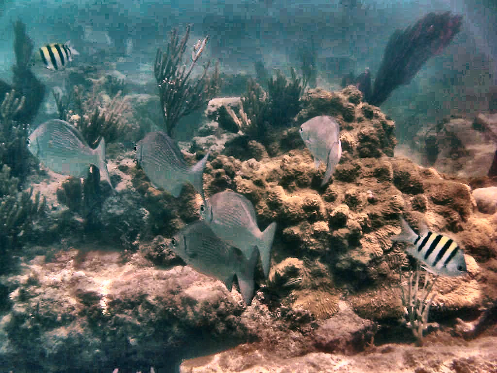
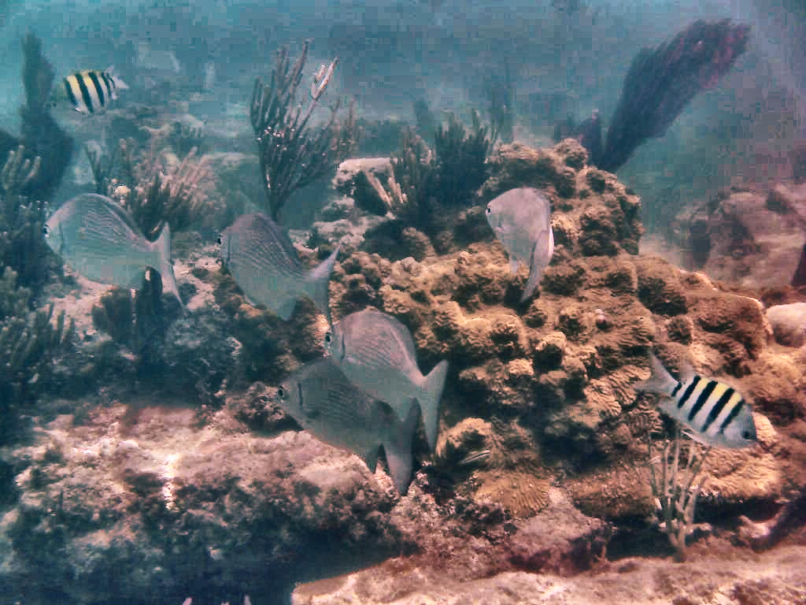

<p align="center">
  <h1 align="center">Multi-Scale Underwater Image Enhancement</h1>
  <p align="center">
    <b>水下图像增强系统</b> — 基于物理模型与多尺度金字塔融合<br>
    Python + OpenCV  |  CLI  |  GUI
  </p>
 </p>

<p align="center">
  
  
  
</p>

---

## Overview

A multi-scale underwater image enhancement system that employs a **6-stage cascaded physical pipeline** (white balance → red channel recovery → CLAHE → dark channel dehazing → unsharp masking → gamma correction) combined with an optional **multi-scale pyramid fusion** strategy for spatial-adaptive enhancement.

|                    Single Pipeline                    |                   Multi-Scale Fusion                    |
|:-----------------------------------------------------:|:-------------------------------------------------------:|
|             Fast, tunable, 6-step cascade             |          5 configs fused via Laplacian pyramid          |
| `main.py` use_fusion=False `(gui.py)` Single Pipeline | `main.py` use_fusion=True `(gui.py)` Multi-scale fusion |

**Key features:**

- 6-stage cascaded physical enhancement with adjustable parameters
- Multi-scale Laplacian pyramid fusion of multiple enhancement versions
- Auto-detection of water type (yellow / green / neutral) for adaptive parameter selection
- Objective quality metrics: **UIQM** (UICM, UISM, UIConM), **UCIQE**, PSNR, SSIM
- Dual-mode operation: CLI batch processing + GUI with real-time preview
- Test images based on the **UIEB Dataset** ([Dowload address](https://li-chongyi.github.io/proj_benchmark.html))

---

## Pipeline

```
Input 
  ↓
White Balance → Red Channel Recovery
                                 ↓
                               CLAHE → Dark Channel Dehaze
                                               ↓
                                          Unsharp Mask → Gamma Correction
                                                             ↓
                                                       Enhanced Output
```

With **fusion ON**:
```
Input → Config₁ → Pipeline → Version₁ ─┐
      → Config₂ → Pipeline → Version₂ ─┤
      → Config₃ → Pipeline → Version₃ ─┼→ Weight Maps → Gaussian Pyramids
      → Config₄ → Pipeline → Version₄ ─┤                     ↓
      → Config₅ → Pipeline → Version₅ ─┘            Version Laplacian Pyramids
                                                             ↓
                                                     Fused Laplacian → Reconstruct → Output
```

---

## Project Structure

```
underwater_enhancement/
├── main.py                  # CLI batch processing entry
├── gui.py                   # GUI entry (tkinter)
├── enhancer.py              # 6 enhancement algorithms + pipeline controller
├── fusion.py                # Multi-scale pyramid fusion module
├── utils.py                 # I/O + quality metrics + visualization
├── check_env.py             # Environment checker
├── requirements.txt         # Dependencies
└──  tests/
    └── test_images/
        ├── original/        # Input images (named 1.png ~ 20.png)
        ├── results/         # Single-pipeline outputs
        └── results_mul/     # Fusion mode outputs

```

---

## Installation

```bash
# Clone the repository
git clone https://github.com/KImigram/multi-scale underwater-enhancement.git
cd underwater-enhancement

# Install dependencies
pip install -r requirements.txt
```

### Dependencies

| Package | Version | Purpose |
|---------|---------|---------|
| opencv-python | ≥ 4.5.0 | Core image processing |
| opencv-contrib-python | ≥ 4.5.0 | Guided filter (ximgproc) |
| numpy | ≥ 1.19.0 | Numerical computation |
| matplotlib | ≥ 3.3.0 | Visualization |
| scikit-image | ≥ 0.18.0 | SSIM metric |
| Pillow | ≥ 9.0.0 | Tkinter image display |

Run `python check_env.py` to verify your environment.

---

## Usage

### Mode 1: CLI Batch Processing (`main.py`)

Place test images (named `1.png`, `2.png`, ..., `20.png`, supported formats: `.jpg/.jpeg/.png/.bmp`) in `tests/test_images/original/`, then:

```bash
python main.py
```

The program will:
1. Auto-detect water type (yellow/green/neutral) per image
2. Select optimal pipeline parameters or run multi-scale fusion
3. Save enhanced results, intermediate steps, and summary figures to `results/` (single) or `results_mul/` (fusion)
4. Print UIQM / UCIQE metrics per image + final average

**Configuration** — edit the top of `main.py`:

```python
CONFIG = {
    "use_fusion": True,          # True = multi-scale fusion, False = single pipeline
    "auto_detect": True,         # Auto water-type detection
    "start_num": 1,              # First image index
    "end_num": 20,               # Last image index
    # ... parameter overrides ...
}
```
**CLI Output** — process log for each image & final info:
```
# processing log
──────────────────────────────────────────────────
  [1/17] 处理: 1.png
──────────────────────────────────────────────────
  [检测] 水体类型: green
[Pipeline] white_balance 参数已更新: {'a_shift': -10, 'b_shift': 0}
[Pipeline] red_channel 参数已更新: {'strength': 0.4}
[Pipeline] clahe 参数已更新: {'clip_limit': 3.0, 'grid_size': (8, 8)}
[Pipeline] dehaze 参数已更新: {'omega': 0.72, 't_min': 0.28, 'use_guided_filter': True, 'kernel_size': 15}
[Pipeline] unsharp_mask 参数已更新: {'amount': 1.3, 'radius': 0.5}
[Pipeline] gamma 参数已更新: {'gamma': 1.15}
  耗时: 0.32s
[IO] 图像已保存: D:\my program\Python work\underwater_enhancement\tests/test_images/results\1_enhanced.png
  汇总图已保存: 1_summary.png
  UIQM: 91.6673   UCIQE: 0.7272999882698059

# final info
============================================================
  处理完成 (17/17 张)
============================================================
  平均 UIQM:  93.9616
  平均 UCIQE: 0.89590

完成！所有结果已保存到: D:\my program\Python work\underwater_enhancement\tests/test_images/results

```


### Mode 2: GUI Interactive (`gui.py`)

```bash
python gui.py
```
**Mainwindow** — main processing Panel
- Left Panel: Real-time preview of the process step-by-step
- Right Panel:  Mode selector (Single / Fusion) | Parameter tuning console | Quality mertics display
- click *Browser* to select single image to be processed 
- click *Start Processing* to begin visible enhancement process

**Image Manager** — click *Image Manager* to open a popup for uploading, deleting, and previewing test images.

<!-- GUI screenshots -->
<p align="center">
  <table>
    <tr>
      <td align="center"><b>GUI Main Window</b></td>
      <td align="center"><b>Image Manager</b></td>
    </tr>
    <tr>
      <td></td>
      <td></td>
    </tr>
  </table>
</p>

---

## Enhancement Modules

| # | Module | Technique | Key APIs |
|:-:|--------|-----------|----------|
| 1 | **White Balance** | LAB space A/B channel mean normalization | `cv2.cvtColor`, `cv2.split/merge` |
| 2 | **Red Channel Recovery** | Histogram equalization + weighted fusion | `cv2.equalizeHist`, `cv2.addWeighted` |
| 3 | **CLAHE** | Contrast-limited adaptive histogram equalization | `cv2.createCLAHE` |
| 4 | **Dark Channel Dehaze** | DCP + atmospheric light + transmission + guided filter | `cv2.erode`, `cv2.ximgproc.guidedFilter` |
| 5 | **Unsharp Mask** | Gaussian blur + addWeighted | `cv2.GaussianBlur`, `cv2.addWeighted` |
| 6 | **Gamma Correction** | LUT nonlinear mapping | `cv2.LUT` |

---

## Quality Metrics

| Metric | Description | Type | Target |
|--------|-------------|------|--------|
| **UIQM** | Underwater Image Quality Measure (UICM + UISM + UIConM) | No-reference | Higher is better |
| **UCIQE** | Underwater Color Image Quality Evaluation | No-reference | Higher is better |
| **PSNR** | Peak Signal-to-Noise Ratio | Full-reference | Higher is better |
| **SSIM** | Structural Similarity Index | Full-reference | Closer to 1 is better |

---

## Results Gallery

### Single Pipeline — Step-by-step

<!-- summary example placeholder -->
<p align="center">
  <i>Original → White Balance → Red Recovery → CLAHE → Dehaze → Unsharp Mask → Gamma → Enhanced</i>
  <br>
  
</p>

### Multi-Scale Fusion

|              Original              | Default | Anti-Yellow | Anti-Green | Dehaze+ | Mild | Fused |
|:----------------------------------:|:---:|:---:|:---:|:---:|:---:|:---:|
|  |  | — |  |  | — |  |

> *Image 7 example: auto-detected as green water → selected Default, Anti-Green, Dehaze-Plus configs.*

### Water Type Detection

|                 Yellow Water                  |                 Green Water                  |
|:---------------------------------------------:|:--------------------------------------------:|
|  |  |
|                  b_shift < 0                  |              a_shift < 0, red+               |

---

## Configuration Reference

### Single Pipeline Parameters

| Parameter | Range | Default | Description |
|-----------|-------|---------|-------------|
| `a_shift` | -50 ~ 50 | 0 | A channel offset (green↔magenta) |
| `b_shift` | -50 ~ 50 | 0 | B channel offset (blue↔yellow) |
| `red_strength` | 0.1 ~ 0.5 | 0.30 | Red channel recovery intensity |
| `clahe_limit` | 0.5 ~ 4.0 | 2.0 | CLAHE contrast limit |
| `dehaze_omega` | 0.5 ~ 0.95 | 0.75 | Haze retention coefficient |
| `dehaze_tmin` | 0.2 ~ 0.5 | 0.35 | Minimum transmission |
| `sharpen_amount` | 1.0 ~ 2.0 | 1.2 | Sharpening intensity |
| `gamma` | 0.8 ~ 1.5 | 1.1 | Gamma correction value |

---

## Algorithm References

- OpenCV. (2025). *Guide to underwater image enhancement using OpenCV*. https://opencv.org/blog/underwater-image-enhancement-using-opencv/. 
- He, K., Sun, J., & Tang, X. (2009). *Single Image Haze Removal Using Dark Channel Prior*. CVPR.
- Ancuti, C., Ancuti, C. O., Haber, T., & Bekaert, P. (2012). *Enhancing Underwater Images and Videos by Fusion*. CVPR.
- Panetta, K., Gao, C., & Agaian, S. (2016). *Human-Visual-System-Inspired Underwater Image Quality Measures*. IEEE JOE.
- Yang, M., & Sowmya, A. (2015). *An Underwater Color Image Quality Evaluation Metric*. IEEE TIP.
- Pizer, S. M., et al. (1987). *Adaptive Histogram Equalization and its Variations*. Computer Vision, Graphics, and Image Processing.
- C. Li, C. Guo, W. Ren, R. Cong, J. Hou, S. Kwong, D. Tao, “An Underwater Image Enhancement Benchmark Dataset and Beyond,” IEEE Trans. Image Process., vol. 29, pp.4376-4389, 2019.

---

## License

MIT License. See [LICENSE](LICENSE) for details.
